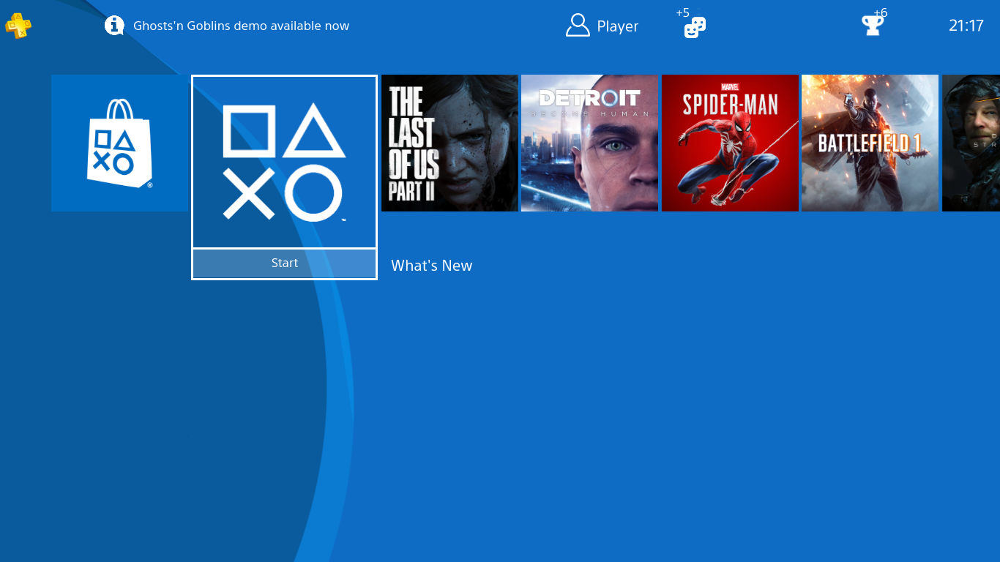

# Ps4-UI



## Description

**Ps4-UI** is a project that recreates the user interface (UI) of the PlayStation 4 using HTML, JavaScript, and CSS. With it, you can explore a faithful recreation of the iconic PS4 interface right in your web browser.

## Features

- **Familiar Interface**: Navigate through an interface closely resembling the PlayStation 4 experience.
- **Simple Navigation**: Explore menus, icons, and PS4 features intuitively.
- **Customization**: Experience the feeling of customization with profile and settings options.
- **Remote Control**: Use controls to navigate the interface and access different sections.
- **Gamepad Support**: Ps4-UI also supports gamepads for an authentic experience.

## How to Use

You can experience Ps4-UI in two ways:

1. **Clone the Repository**:

```shell
git clone https://github.com/d4v1-sudo/Ps4-UI.git
```

Then, open the `index.html` file in your browser to start exploring the interface.

2. **Download the ZIP File**:

- Go to the main repository page at [https://github.com/d4v1-sudo/Ps4-UI.git](https://github.com/d4v1-sudo/Ps4-UI.git).
- Click the "Code" button and select "Download ZIP."
- Extract the ZIP file on your computer and open the `index.html` file in your browser.

## Contributions

Contributions are welcome! Feel free to open issues or send pull requests to enhance this project.

## License

This project is licensed under the [MIT License](LICENSE). Feel free to use it for personal or commercial purposes.

Enjoy exploring the PlayStation 4 interface recreated in Ps4-UI! If you have any questions or feedback, don't hesitate to get in touch.
